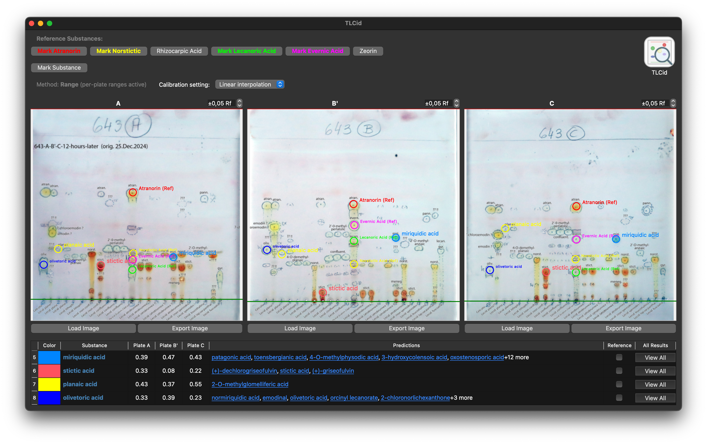

<p align="center">
  
</p>

<h1 align="center">TLCid</h1>

<p align="center">
  <strong>Thin Layer Chromatography Substance Identification for Lichens</strong>
</p>

TLCid is a desktop application for analyzing TLC (Thin Layer Chromatography) plates, designed specifically for identifying lichen substances. It allows you to load plate images, mark reference lines and spots, and predict substances based on Rf values against a built-in reference database.

## Features

- **Multi-plate support**: Analyze up to 3 TLC plates (A, B', C) side-by-side
- **Rf calculation**: Automatic calculation with linear interpolation calibration using reference standards
- **Substance prediction**: Match spots against a database of 500+ lichen substances
- **Species prediction**: Identify lichen species based on substance profiles
- **Visual filtering**: Filter predictions by genus, UV characteristics, and more
- **Export**: Save annotated plate images and analysis state (JSON)

## Installation

### Prerequisites

- Python 3.10+
- [uv](https://docs.astral.sh/uv/) (recommended) or pip

### Quick Start

1. Clone the repository:
   ```bash
   git clone https://github.com/reslp/tlcid.git
   cd tlcid
   ```

2. Install dependencies:
   ```bash
   uv sync
   ```

3. Run the application:
   ```bash
   uv run main.py
   ```

## Building

### macOS

Build a standalone `.app` bundle:
```bash
uv run pyinstaller tlcid.spec --clean
```
The application will be at `dist/TLCid.app`.

### Windows

Build using Docker (cross-compilation from any OS):
```bash
./build_windows_docker.sh
```
The executable will be at `dist/windows/TLCid/TLCid.exe`.

**Requirements:**
- Docker must be running
- The build uses Wine inside a container for Windows cross-compilation

### Linux

Build a Linux binary bundle using Docker:
```bash
./build_linux_docker.sh
```
The bundle will be at `dist/linux/TLCid/`.

**Requirements:**
- Docker must be running
- Build artifacts are generated inside the container and written to the mounted project directory

## Usage

<p align="center">
  
</p>


1. **Load plate images** using the "Load Image" buttons
2. **Set reference lines**: Click and drag the green start/front lines to mark solvent boundaries
3. **Mark reference standards** (optional): Use Atranorin/Norstictic acid spots for calibration
4. **Add substance spots**: Click on the plate to mark spots
5. **View predictions**: Results appear in the right panel with candidate substances
6. **Refine matches**: Use the characteristics window to filter by genus, UV response, etc.
7. **Predict species**: Use Analysis → Predict species to identify lichens from the substance profile

## Project Structure

```
tlcid/
├── main.py              # Application entry point
├── gui/                 # PyQt6 interface modules
│   ├── mainwindow.py    # Main analysis window
│   ├── database_window.py
│   ├── prediction_results_window.py
│   ├── settings_window.py
│   ├── species_prediction_window.py
│   └── substance_characteristics_window.py
├── tlcid_database.db       # Reference substance database (picked up during release build)
├── examples/            # Sample TLC plate images
└── tlcid.spec           # PyInstaller build spec
```

